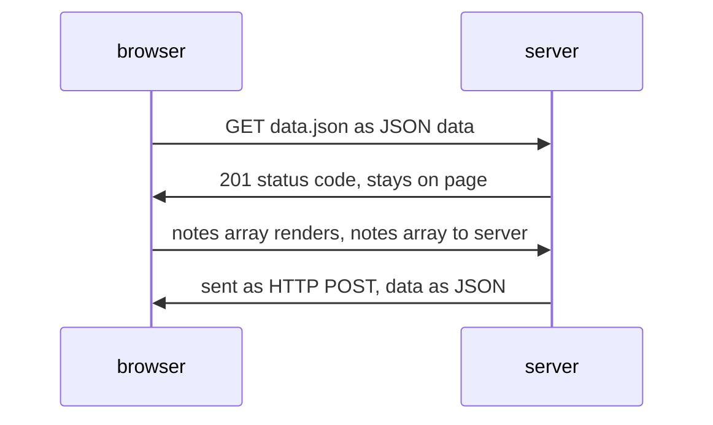

```mermaid
sequenceDiagram
    participant browser
    participant server

    browser->>server: GET data.json as JSON data
    server->>browser: 201 status code, stays on page

    browser->>server: notes array renders, notes array to server
    server->>browser: sent as HTTP POST, data as JSON
```