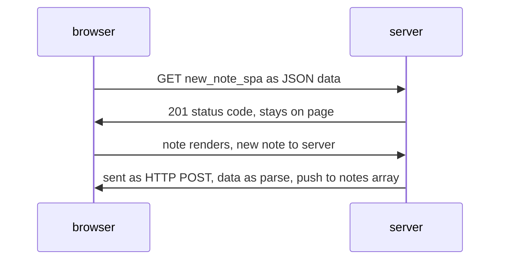

```mermaid
sequenceDiagram
    participant browser
    participant server

    browser->>server: GET new_note_spa as JSON data
    server->>browser: 201 status code, stays on page

    browser->>server: note renders, new note to server
    server->>browser: sent as HTTP POST, data as  parse, push to notes array
    
```