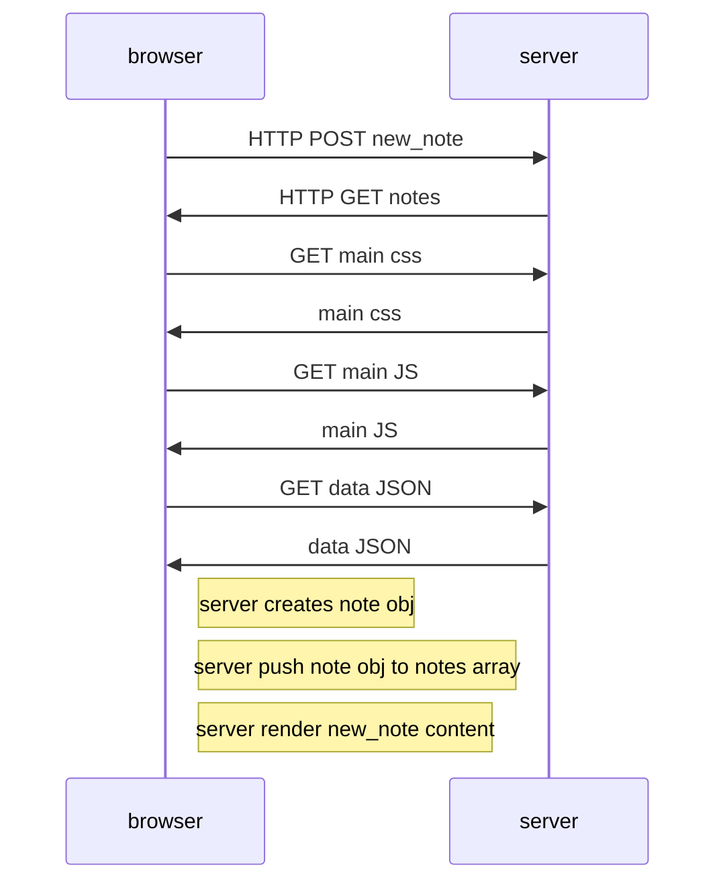

```mermaid
sequenceDiagram
    participant browser
    participant server

    browser->>server: HTTP POST new_note
    server->>browser: HTTP GET notes

    browser->>server: GET main css
    server->>browser: main css

    browser->>server: GET main JS
    server->>browser: main JS

    browser->>server: GET data JSON
    server->>browser: data JSON

    Note right of browser: server creates note obj
    Note right of browser: server push note obj to notes array
    Note right of browser: server render new_note content
```